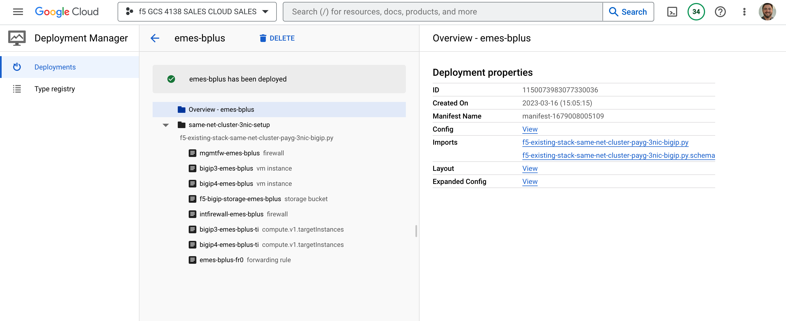

# Scenario: BIG-IP HA via API (CFE) deployed from GDM v1 template

|Link to upstream|Version|Example|
|----------------|-------|-----|
|[GDM v1 via-API, 3nic, PAYG]|v4.3.0|Throughput change(25Mbps -> 1Gbps)||

This folder contains the instructions to modify [GDM v1 via-API, 3nic, PAYG]
template to support a change in BIG-IP edition. This documents will outline the
steps that are generally applicable to any scenario based on this template and
can be adjusted to function with different upstream versions.

The folders [step-1-expand] and [step-3-reduce] contain the patched Python
templates for direct comparison to original sources.

## Prerequisites

* Existing BIG-IP VE deployment in an HA pair that was deployed from F5's
  [GDM v1 via-API, 3nic, PAYG] template
* A new target edition identified; in this example it will be to change BIG-IP
  v16.1.3.3 PAYG Best+ 25mps to BIG-IP v16.1.3.3 PAYG Best+ 1Gbps; target
  image name will be `f5-bigip-16-1-3-3-0-0-3-payg-best-plus-1gbps-221222235120`

## Step 1: Expand the cluster

1. Create a new branch to track step 1 changes to original sources, from your
   existing deployment.

2. Modify your YAML file to use the new `imageName` corresponding to the target
   edition.

   For example, if you were using the sample YAML as configuration, you would
   change line 60 to use the new image.

   <!-- spell-checker: disable -->
   <!-- markdownlint-disable MD010 -->
   ```diff
   diff -x .git -x '*~' -x '*#' -Naur -x .DS_Store existing/f5-existing-stack-same-net-cluster-payg-3nic-bigip.yaml step-1-expand/f5-existing-stack-same-net-cluster-payg-3nic-bigip.yaml
   --- existing/f5-existing-stack-same-net-cluster-payg-3nic-bigip.yaml	2023-03-17 10:35:39.007054404 -0700
   +++ step-1-expand/f5-existing-stack-same-net-cluster-payg-3nic-bigip.yaml	2023-03-17 10:38:47.583620680 -0700
   @@ -57,7 +57,7 @@
    #f5-bigip-16-1-0-0-0-19-payg-hp-ltm-16vcpu-210623020944
    #f5-bigip-16-1-0-0-0-19-payg-pve-ltm-200mbps-210623020944
    #f5-bigip-16-1-0-0-0-19-payg-pve-ltm-25mbps-210623020944
   -   imageName: f5-bigip-16-1-3-3-0-0-3-payg-best-plus-25mbps-221222234728
   +   imageName: f5-bigip-16-1-3-3-0-0-3-payg-best-plus-1gbps-22122223512
       ### (OPTIONAL) Instance type assigned to BIG-IP, for example 'n1-standard-4'.
       instanceType: n1-standard-4
       ### (OPTIONAL) Enter the BIG-IP Management Port, the default is '443'.
   ```
   <!-- markdownlint-enable MD010 -->
   <!-- spell-checker: enable -->

3. Modify the GDM Python script to add two new VE instances, and their corresponding
   `targetInstance` declarations. This change is a little more involved so I
   recommend you apply the supplied [step 1 patch file](existing-to-step-1-expand-python.patch)
   directly to your existing sources:

   <!-- spell-checker: disable -->
   ```shell
   patch -p1 < existing-to-step-1-expand-python.patch
   ```

   ```text
   patching file f5-existing-stack-same-net-cluster-payg-3nic-bigip.py
   ```
   <!-- spell-checker: enable -->

   Alternatively, a fully patched version of the Python file can be found in
   [step-1-expand] folder.

4. Commit the change to your SCM branch.

5. Apply the updated configuration to Google Deployment Manager

   > NOTE: You will need to know the name of the original deployment; you can
   > find this in the Cloud Console GUI through **Deployment Manager** >
   > **Deployments**.

   In this example, my prior deployment was named *emes-bplus*; you should
   substitute your deployment name as appropriate.

   <!-- spell-checker: disable -->
   ```shell
   gcloud deployment-manager deployments update emes-bplus \
       --config f5-existing-stack-same-net-cluster-payg-3nic-bigip.yaml
   ```

   ```text
   The fingerprint of the deployment is b'Ye7UETHHuRaoiR9SHfJzzg=='
   Waiting for update [operation-1679076855986-5f71c8b8d38ce-202c3bae-11dbfea2]...done.
   Update operation operation-1679076855986-5f71c8b8d38ce-202c3bae-11dbfea2 completed successfully.
   NAME                         TYPE                        STATE      ERRORS  INTENT
   bigip1-emes-bplus            compute.v1.instance         COMPLETED  []
   bigip1-emes-bplus-ti         compute.v1.targetInstances  COMPLETED  []
   bigip2-emes-bplus            compute.v1.instance         COMPLETED  []
   bigip2-emes-bplus-ti         compute.v1.targetInstances  COMPLETED  []
   bigip3-emes-bplus            compute.v1.instance         COMPLETED  []
   bigip3-emes-bplus-ti         compute.v1.targetInstances  COMPLETED  []
   bigip4-emes-bplus            compute.v1.instance         COMPLETED  []
   bigip4-emes-bplus-ti         compute.v1.targetInstances  COMPLETED  []
   emes-bplus-fr0               compute.v1.forwardingRule   COMPLETED  []
   f5-bigip-storage-emes-bplus  storage.v1.bucket           COMPLETED  []
   intfirewall-emes-bplus       compute.v1.firewall         COMPLETED  []
   mgmtfw-emes-bplus            compute.v1.firewall         COMPLETED  []
   ```
   <!-- spell-checker: enable -->

   After a successful deployment there will be a total of 4 BIG-IP VEs, and 4
   targetInstances; those labeled *bigip1* or *bigip2* are unchanged, only *bigip3*
   and *bigip4* resources will be created.

   > WARNING: There is a chance that GDM will reset the targetInstance assigned
   > to the forwardingRule to the **standby** BIG-IP VE instance. If this happens,
   > perform a *forced failover* on the active BIG-IP VE so that CFE can reset the
   > forwarding rule correctly.
   >
   > See [FAQ > CFE > No traffic]

6. Set admin password on new VEs

   The newly expanded VEs will use a generated admin password that must be changed
   before proceeding further. SSH to management interface address on *bigip3*
   and *bigip4*, and modify the admin user password.

   E.g. for both new VEs, SSH and modify the password at the TMSH prompt.

   <!-- spell-checker: disable -->
   ```shell
   ssh -i path/to/ssh_key.pub admin@MGMT_IP_ADDRESS
   modify auth user admin prompt-for-password
   ```
   <!-- spell-checker: enable -->

## Step 2: Migrate HA configuration to new VEs

Follow the steps in [Modify HA] to reconfigure BIG-IP device and failover groups.

## Step 3: Remove the original VEs from deployment

1. Remove the unnecessary VEs

   Now that the new HA pair is handling traffic, we can modify the deployment
   to return to a single HA pair of VEs. To do this, apply the changes in
   [step 3 patch](step-1-expand-to-step-3-reduce.patch).

   <!-- spell-checker: disable -->
   ```shell
   patch -p1 < step-1-expand-to-step-3-reduce.patch
   ```

   ```text
   patching file f5-existing-stack-same-net-cluster-payg-3nic-bigip.py
   ```
   <!-- spell-checker: enable -->

   Alternatively, a fully patched version of the Python file can be found in
   [step-3-reduce] folder.

2. Commit the change to your SCM branch.

3. Apply the final configuration to Google Deployment Manager

   Continuing from the prior example, updating *emes-bplus* to final state
   looks like this.

   <!-- spell-checker: disable -->
   ```shell
   gcloud deployment-manager deployments update emes-bplus \
       --config f5-existing-stack-same-net-cluster-payg-3nic-bigip.yaml
   ```

   ```text
   The fingerprint of the deployment is b'GCVehy8RkQa3_KtRihp2VA=='
   Waiting for update [operation-1679008005087-5f70c83b7e239-8dd4e131-9234e242]...done.
   Update operation operation-1679008005087-5f70c83b7e239-8dd4e131-9234e242 completed successfully.
   NAME                         TYPE                        STATE      ERRORS  INTENT
   bigip3-emes-bplus            compute.v1.instance         COMPLETED  []
   bigip3-emes-bplus-ti         compute.v1.targetInstances  COMPLETED  []
   bigip4-emes-bplus            compute.v1.instance         COMPLETED  []
   bigip4-emes-bplus-ti         compute.v1.targetInstances  COMPLETED  []
   emes-bplus-fr0               compute.v1.forwardingRule   COMPLETED  []
   f5-bigip-storage-emes-bplus  storage.v1.bucket           COMPLETED  []
   intfirewall-emes-bplus       compute.v1.firewall         COMPLETED  []
   mgmtfw-emes-bplus            compute.v1.firewall         COMPLETED  []
   ```
   <!-- spell-checker: enable -->

   After a successful deployment there will be a total of 2 BIG-IP VEs, and 4
   targetInstances; those that were labeled *bigip1* or *bigip2* are destroyed,
   only *bigip3* and *bigip4* resources remain.

   > WARNING: There is a chance that GDM will reset the targetInstance assigned
   > to the forwardingRule to the **standby** BIG-IP VE instance. If this happens,
   > perform a *forced failover* on the active BIG-IP VE so that CFE can reset the
   > forwarding rule correctly.
   >
   > See [FAQ > CFE > No traffic]

4. Merge SCM changes to your main target


At this point the Google Deployment Manager state managed by GCP, and your deployment
templates will be aligned, and the active-standby HA pair has been updated to the
new target edition.

[GDM v1 via-API, 3nic, PAYG]: https://github.com/F5Networks/f5-google-gdm-templates/tree/v4.3.0/supported/failover/same-net/via-api/3nic/existing-stack/payg
[step-1-expand]: step-1-expand/
[step-3-reduce]: step-3-reduce/
[Modify HA]: ../../../../../../../../Modifying_HA.md
[FAQ > CFE > No traffic]: https://github.com/memes/f5-bigip-ha-replace-edition/wiki/CFE-No-traffic
