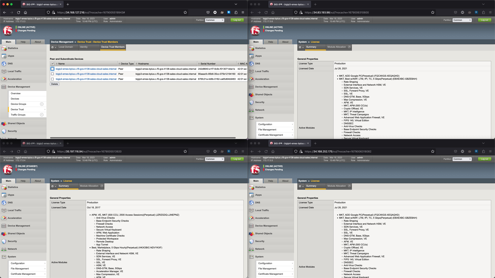
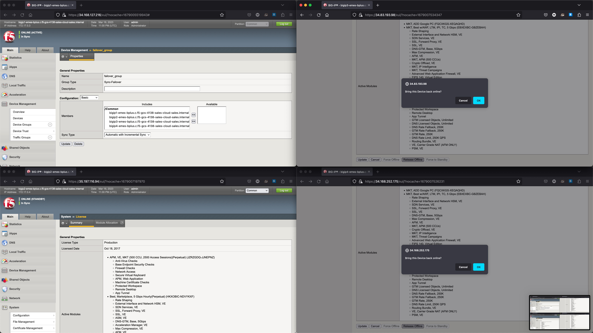

# Step 2: Modifying the BIG-IP HA cluster groups

These are the steps to take withing BIG-IP VE GUI to migrate a running HA deployment
to a new base edition.

## Prerequisites

[Step 1] that is appropriate for your scenario has been completed.


* Original BIG-IP VEs (*bigip1* top left, and *bigip2* bottom left) are fully
functional, with GUI access through an administrative account
* New BIG-IP VEs (*bigip3* top right, and *bigip4* bottom right) have completed
initial onboarding, with GUI access through an administrative account
* All extensions installed on *bigip1* and *bigip2* are present on *bigip3* and
*bigip4* too, and running at the same version
* *bigip1* and *bigip2* are part of an active-standby HA pair and fully in sync
* *bigip3* and *bigip4* are effectively standalone instances that are not
  receiving traffic

## Instructions

1. Extend the device trust group to all four VE instances

   
   On the active VE, navigate to Device Trust and add *bigip3* to the group through
   it's management self-ip address.

   
   Repeat for *bigip4* device.

   
   After a brief period, the devices should update and show that changes are pending
   on all four.

2. Push device configuration from original BIG-IP VEs to the new VEs

   
   * On the active VE, click on **Changes Pending**
   * Select **Push the selected config to group**
   * Click **Sync**

   

   > WARNING: When prompted, study the proposed changes and make sure that the
   > currently active BIG-IP VE (*bigip1* in these screenshots) *will remain online*.
   > The intent is to preserve traffic flow through the active BIG-IP.

   After a few seconds, all four BIG-IP VEs will have an in sync configuration,
   but only *bigip1* and *bigip2* are actively participating in the failover group
   and eligible to handle traffic. You will need to reauthenticate on *bigip3*
   and *bigip4*.

3. CFE only: Reconfigure to incorporate new devices

   > NOTE: This step is only required for solutions that use Cloud Failover Extension
   > (CFE) to update Google resources. Solutions that use a GCP L4 load balancer
   > can skip to item 4.

   Using your current CFE declaration as a base, add the self-ips of *bigip3* and
   *bigip4* to the configuration.

   <!-- spell-checker: disable -->
   ```json
   {
        "class": "Cloud_Failover",
        "environment": "gcp",
        "externalStorage": {
            "scopingTags": {
                "f5_cloud_failover_label": "emes-bplus"
            }
        },
        "failoverAddresses": {
            "scopingTags": {
                "f5_cloud_failover_label": "emes-bplus"
            },
            "requireScopingTags": false
        },
        "failoverRoutes": {
            "scopingTags": {
                "f5_cloud_failover_label": "emes-bplus"
            },
            "scopingAddressRanges": [
                {
                    "range": "192.0.2.0/24"
                }
            ],
            "defaultNextHopAddresses": {
                "discoveryType": "static",
                "items": [
                    "172.16.0.2",
                    "172.16.0.3"
                ]
            }
        },
        "controls": {
            "class": "Controls",
            "logLevel": "info"
        },
        "schemaVersion": "1.14.0"
    }
    ```
    <!-- spell-checker: enable -->

    For example, the CFE declaration above has next hop addresses that map to
    external interface self-ips on *bigip1* and *bigip2*. This configuration
    needs to be changed to include the external interface self-ips of *bigip3*
    and *bigip4*, as shown below.

    <!-- spell-checker: disable -->
    ```json
    {
        "class": "Cloud_Failover",
        "environment": "gcp",
        "externalStorage": {
            "scopingTags": {
                "f5_cloud_failover_label": "emes-bplus"
            }
        },
        "failoverAddresses": {
            "scopingTags": {
                "f5_cloud_failover_label": "emes-bplus"
            },
            "requireScopingTags": false
        },
        "failoverRoutes": {
            "scopingTags": {
                "f5_cloud_failover_label": "emes-bplus"
            },
            "scopingAddressRanges": [
                {
                    "range": "192.0.2.0/24"
                }
            ],
            "defaultNextHopAddresses": {
                "discoveryType": "static",
                "items": [
                    "172.16.0.2",
                    "172.16.0.3",
                    "172.16.0.4",
                    "172.16.0.5"
                ]
            }
        },
        "controls": {
            "class": "Controls",
            "logLevel": "info"
        },
        "schemaVersion": "1.14.0"
    }
    ```
    <!-- spell-checker: enable-->

    

    This configuration must be POSTed to the [CFE endpoints] of *bigip2*,
    *bigip3*, and *bigip4*. Now CFE will be ready if any of the VEs becomes the
    active instance in the group.

4. Force new VEs offline

   To make sure that the new VEs do not process traffic until ready, they must
   be *forced offline*.

   

   On *bigip3* and *bigip4*, click on *Active* and scroll to the bottom of the
   page, then click **Force Offline**.

   

   Confirm that *bigip3* and *bigip4* should be taken offline.

   

   After a brief pause, *bigip3* and *bigip4* will show as **Forced Offline**.

5. Extend failover group to include new VEs

   

   On the active VE, navigate to failover groups.

   

   If necessary, change **Sync Type** to *Manual with Full Sync* - you can change
   it back later.
   Add the two new VEs as members of the group, and click **Update**.

   

   After a few seconds, all the BIG-IP VEs should indicate that the group is out
   of sync. Click on **Awaiting Initial Sync** on the active VE.

   

   Select the active VE instance and ensure
   **Push the selected device configuration to the group** is selected. Click
   **Sync**.

   

   > You may have to reauthenticate on *bigip3* and *bigip4*.

   

   All BIG-IP VEs should now be in sync, with *bigip3* and *bigip4* still
   **Forced Offline**.

   

   If you changed the failover group's **Sync Type** earlier, now is a good time
   to change it back to what it was before.

6. Release offline for *bigip3* and *bigip4*

   

   On *bigip3* and *bigip4*, click on **Forced Offline** and scroll to the end of
   the page. Click **Release Offline**.

   

   Confirm that *bigip3* and *bigip4* should be released from **Forced Offline**
   status.

7. Failover to a new BIG-IP VE

   

   On the current active BIG-IP, click on **Active**. In the failover screen
   verify that the **Next Active Device** is one of *bigip3* or *bigip4*.
   Click **Force to Standby**

   

   Confirm that you do want to force the device to standby.

   

   * One of the new BIG-IP VEs will be *active*
   * One of the new BIG-IP VEs will be *standby*, along with both of the original
     VEs

8. CFE only: Reconfigure to exclude old devices

   > NOTE: This step is only required if you had to make a change to CFE in step
   > 3 that required explicitly adding BIG-IP self-ips to the declaration. If you
   > didn't perform step 3 you can skip ahead to step 9.

   Using the CFE declaration from step 3, remove the self-ips of *bigip1* and
   *bigip2* from the configuration.

   <!-- spell-checker: disable -->
   ```json
    {
        "class": "Cloud_Failover",
        "environment": "gcp",
        "externalStorage": {
            "scopingTags": {
                "f5_cloud_failover_label": "emes-bplus"
            }
        },
        "failoverAddresses": {
            "scopingTags": {
                "f5_cloud_failover_label": "emes-bplus"
            },
            "requireScopingTags": false
        },
        "failoverRoutes": {
            "scopingTags": {
                "f5_cloud_failover_label": "emes-bplus"
            },
            "scopingAddressRanges": [
                {
                    "range": "192.0.2.0/24"
                }
            ],
            "defaultNextHopAddresses": {
                "discoveryType": "static",
                "items": [
                    "172.16.0.4",
                    "172.16.0.5"
                ]
            }
        },
        "controls": {
            "class": "Controls",
            "logLevel": "info"
        },
        "schemaVersion": "1.14.0"
    }
    ```

    

    This configuration can be POSTed to the [CFE endpoints] of any of the standby
    instances; in the example shown above, Postman is used to push the final CFE
    configuration to *bigip4*.

9. Remove original VEs from failover group

   On any of the standby VEs, navigate to the failover group definition.

   

   Remove *bigip1* and *bigip2* from failover group members, and click **Update**.

   

   *bigip1* and *bigip2* are **Active** but no longer members of the failover group.

10. Remove original VEs from device trust group

   

   On one of the new VEs, navigate to **Device Management** > **Device Trust**.
   Select the checkboxes for the two original VEs, and click **Delete**.

   

   Confirm that the original VEs should be removed from device trust.

   

   At this point, *bigip3* and *bigip4* are the only remaining members of the
   failover group and device trust group; *bigip1* and *bigip2* are standalone
   devices ready to be removed from the deployment.

## Next Steps

Return to [step 3] for your specific scenario to reduce the number of BIG-IP VE
instances that are running in Google Cloud. Since they are no longer handling
traffic they can be removed.

[step 1]: README.md#step-1-expand-the-cluster
[step 3]: README.md#step-3-remove-the-original-ves-from-deployment
[cfe endpoints]: https://clouddocs.f5.com/products/extensions/f5-cloud-failover/latest/userguide/configuration.html#endpoints
